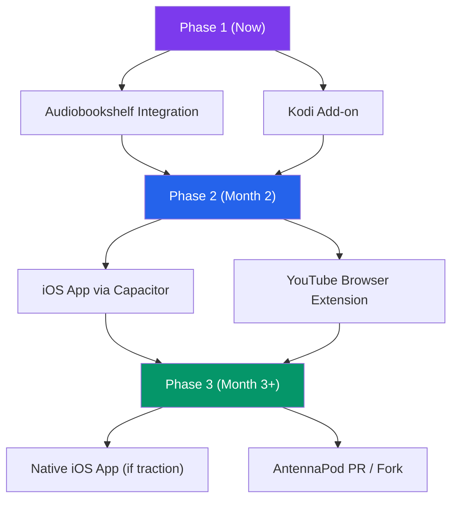

# RewindCast — Expansion Paths Analysis

> iOS App • Spotify/YouTube Integration • Open-Source Platform Integration

---

## Quick Verdict

| Path | Feasibility | Effort | Recommended? |
|------|:-----------:|:------:|:------------:|
| 🍎 iOS App (via Capacitor) | ✅ High | 🟡 Medium | ✅ Yes |
| 🍎 iOS App (native Swift) | ✅ High | 🔴 High | ⚠️ Only if going pro |
| 🎵 Spotify Extension | ❌ Blocked | N/A | ❌ No |
| 📺 YouTube Integration | 🟡 Partial | 🟡 Medium | ⚠️ Browser extension only |
| 📚 Audiobookshelf Integration | ✅ High | 🟢 Low-Medium | ✅ **Best first target** |
| 🎬 Kodi Add-on | ✅ High | 🟢 Low | ✅ Yes |
| 📻 AntennaPod / Podcast Apps | ⚠️ Limited | 🔴 High | ⚠️ Fork required |
| 🎧 VLC Extension | 🟡 Partial | 🟡 Medium | ⚠️ Lua limitations |

---

## Path 1: 🍎 iOS App

**Can RewindCast become an iOS app? Yes — and you have two realistic options.**

### Option A: Capacitor Wrapper (Recommended for you)

This wraps your existing Next.js frontend inside a native iOS WebView container. You keep ~95% of your existing code.

```
┌─────────────────────────────────────┐
│           iOS App (Capacitor)        │
│  ┌─────────────────────────────┐    │
│  │    Next.js Frontend (WebView)│    │
│  │    ┌───────────────────┐    │    │
│  │    │ Your existing UI  │    │    │
│  │    │ (React components)│    │    │
│  │    └───────────────────┘    │    │
│  └──────────┬──────────────────┘    │
│             │ Capacitor Bridge       │
│  ┌──────────▼──────────────────┐    │
│  │  Native iOS APIs            │    │
│  │  (Background Audio, Push,   │    │
│  │   File System, Share Sheet) │    │
│  └─────────────────────────────┘    │
└─────────────────────────────────────┘
          │  HTTP API calls
          ▼
┌─────────────────────────────────────┐
│   RewindCast Backend (FastAPI)       │
│   (Self-hosted or cloud-deployed)   │
└─────────────────────────────────────┘
```

**What's needed:**
1. Configure Next.js for static export (`output: 'export'`)
2. Install Capacitor: `npm install @capacitor/core @capacitor/cli @capacitor/ios`
3. Initialize: `npx cap init RewindCast com.rewindcast.app --web-dir=out`
4. Add iOS: `npx cap add ios`
5. Build & sync: `next build && npx cap sync`
6. Open in Xcode: `npx cap open ios`

**Effort:** ~2-3 days for a working prototype

> [!IMPORTANT]
> **Key constraint:** The backend (FastAPI + Whisper + Gemini) can't run *on* the iPhone. The iOS app would need to connect to a **remotely hosted backend** (your home server, a VPS, or a cloud service). This means the user needs either:
> - A self-hosted backend accessible via the internet (e.g., Tailscale, Cloudflare Tunnel)
> - A cloud-deployed backend (e.g., on Railway, Fly.io, or Google Cloud Run)

### Option B: Native Swift App

A full rewrite of the frontend in SwiftUI. Provides the best native feel but requires learning Swift/SwiftUI.

**Effort:** ~4-8 weeks for a full app
**When to choose this:** Only if you plan to make RewindCast a serious App Store product

### Comparison

| Aspect | Capacitor (WebView) | Native Swift |
|--------|:-------------------:|:------------:|
| Code reuse from current project | ~95% | ~0% (backend API only) |
| Native look & feel | Good (with effort) | Excellent |
| Background audio playback | ✅ Via plugin | ✅ Native |
| App Store approval | ✅ Accepted | ✅ Accepted |
| Time to prototype | 2-3 days | 4-8 weeks |
| Learning curve for you | Low | High (new language) |

---

## Path 2: Spotify & YouTube Integration

### 🎵 Spotify — ❌ Dead End

**Spotify has essentially shut down third-party developer access as of 2026.**

- Development Mode now requires **Spotify Premium**
- Limited to **1 Client ID** and **5 test users** max
- Most useful endpoints have been **removed or restricted**
- Spotify explicitly repositioned its API as "experimental only" — no production apps
- They already have their own **Audiobook Recaps** feature (doing what RewindCast does)

> [!CAUTION]
> Building a Spotify integration would be wasted effort. Even if you built it, Spotify's restrictions would prevent it from being usable by more than 5 people, and they could revoke your access at any time.

### 📺 YouTube — ⚠️ Partial (Browser Extension)

YouTube has **no plugin/extension system** for their player, but there are two viable approaches:

#### Option A: Chrome/Firefox Browser Extension
You could build a browser extension that:
- Detects when a user is watching a YouTube video
- Adds a "RewindCast" button overlay to the YouTube player
- Reads the current timestamp via the YouTube IFrame Player API
- Sends the video URL + timestamp to your RewindCast backend
- Plays back the spoken recap in a popup

```
┌─────────────────────────────────────────────┐
│  YouTube.com (Browser Tab)                   │
│  ┌─────────────────────────────────────┐    │
│  │  YouTube Player                      │    │
│  │  ┌─────────────────────────────┐    │    │
│  │  │  Video playing...           │    │    │
│  │  │            [⏪ RewindCast]   │◄───┼────┼── Injected button
│  │  └─────────────────────────────┘    │    │
│  └─────────────────────────────────────┘    │
└──────────────────┬──────────────────────────┘
                   │ content script reads timestamp
                   ▼
┌─────────────────────────────────────────────┐
│  RewindCast Backend (API call)              │
│  → Transcript → Gemini Summary → TTS       │
└──────────────────┬──────────────────────────┘
                   │ returns audio recap
                   ▼
┌─────────────────────────────────────────────┐
│  Extension Popup: plays spoken recap 🔊     │
└─────────────────────────────────────────────┘
```

**Effort:** ~1-2 weeks
**Limitation:** Browser extensions can break when YouTube updates their UI

#### Option B: YouTube Data API (Current Approach)
Your existing approach of pasting YouTube URLs into RewindCast already works via `yt-dlp`. This is actually the most reliable method.

---

## Path 3: Open-Source Platform Integration

**This is where the real opportunity lies.** Here are the best candidates, ranked:

---

### 🥇 Audiobookshelf — **Best Integration Target**

| Aspect | Details |
|--------|---------|
| **What it is** | Self-hosted server for audiobooks & podcasts |
| **Users** | 15K+ GitHub stars, active community |
| **API** | Full REST API with JWT auth, playback sessions, progress tracking |
| **Why it's perfect** | It already tracks **listening position** — exactly what RewindCast needs! |

**Integration approach:**
```
┌─────────────────────────────────────────────┐
│  Audiobookshelf Server                       │
│  ┌─────────────────────────────────────┐    │
│  │  User is listening to Episode X      │    │
│  │  Current position: 25:30            │    │
│  │  [📎 Generate Recap]                │    │
│  └──────────────┬──────────────────────┘    │
│                 │ API: GET /api/me/progress  │
└─────────────────┼───────────────────────────┘
                  │
                  ▼
┌─────────────────────────────────────────────┐
│  RewindCast Companion Service               │
│  1. Fetch audio file from Audiobookshelf    │
│  2. Transcribe up to 25:30                  │
│  3. Generate scaled recap via Gemini        │
│  4. TTS → spoken recap audio                │
│  5. Push recap back as "chapter note" or    │
│     serve via companion web UI              │
└─────────────────────────────────────────────┘
```

**How to build it:**
1. Build a RewindCast "companion" Docker container that sits alongside Audiobookshelf
2. Use Audiobookshelf's API to fetch the user's current listening position
3. Download the audio file via Audiobookshelf's streaming API
4. Run RewindCast's existing pipeline (transcribe → summarize → TTS)
5. Serve the recap via a companion web UI or push it as a custom metadata entry

**Effort:** ~1-2 weeks (your backend already does 90% of this)

> [!TIP]
> This is the **#1 recommendation**. Audiobookshelf users are exactly the self-hosting, power-listener audience that would love RewindCast. You could even contribute it as a community integration, which would get you massive visibility in the self-hosted community.

---

### 🥈 Kodi Add-on — **Easiest Integration**

| Aspect | Details |
|--------|---------|
| **What it is** | Open-source home theater / media center |
| **Users** | Millions worldwide, massive add-on ecosystem |
| **Plugin System** | Full Python-based add-on system (`plugin.audio.*`) |
| **Why it's great** | Write a Python add-on that calls your RewindCast API |

**How it works:**
- Create a `plugin.audio.rewindcast` Kodi add-on
- The add-on hooks into Kodi's `onPlayBackStopped` / `onPlayBackPaused` events
- It sends the current media file + position to your RewindCast backend
- Receives the spoken recap audio and plays it back in Kodi

**Files needed:**
```
plugin.audio.rewindcast/
├── addon.xml          # Add-on metadata
├── default.py         # Main entry point (Python)
├── icon.png           # Add-on icon
├── fanart.jpg         # Background art
└── resources/
    └── settings.xml   # User settings (backend URL, API key)
```

**Effort:** ~3-5 days
**Bonus:** Kodi runs on everything — Linux, Windows, Mac, Raspberry Pi, Android, iOS

---

### 🥉 AntennaPod (Android Podcast Player) — **Fork Required**

| Aspect | Details |
|--------|---------|
| **What it is** | Most popular open-source podcast player (Android) |
| **Plugin System** | ❌ None — no plugin API |
| **Integration path** | Fork the app and add a "Recap" button to the player UI |

**Why it's harder:**
- AntennaPod is written in Java/Kotlin
- No plugin system, so you'd need to fork the entire codebase
- Your fork would need to be maintained separately
- The AntennaPod team has explicitly declined plugin system requests

**Effort:** ~3-4 weeks (requires learning Android/Kotlin)
**Better alternative:** Propose it as a feature to the AntennaPod team via GitHub Issues. If they like it, they might integrate it upstream.

---

### 🎵 VLC Extension — **Limited but Possible**

| Aspect | Details |
|--------|---------|
| **Plugin System** | Lua scripts (limited) or Python via `python-vlc` bindings (external) |
| **Integration** | Create a Lua extension or a companion Python script |

**Limitation:** VLC's Lua extensions are sandboxed — they can't make HTTP calls easily. The better approach is a **companion Python script** that:
1. Uses `python-vlc` to monitor playback position
2. When the user triggers a hotkey, sends the media + position to RewindCast backend
3. Plays back the recap audio

**Effort:** ~1 week

---

### 🎶 Funkwhale / Pinepods — **Niche but Aligned**

| Platform | Why Consider | Integration Path |
|----------|-------------|-----------------|
| **Funkwhale** | Federated audio platform with REST API | Build a companion service using their Django API |
| **Pinepods** | Self-hosted podcast ecosystem, highly customizable | Most aligned with RewindCast's self-hosted philosophy |

**Effort:** ~2-3 weeks each

---

## Recommended Roadmap



| Phase | Target | Why This Order |
|-------|--------|----------------|
| **Phase 1** | Audiobookshelf + Kodi | Lowest effort, highest community overlap, validates the product |
| **Phase 2** | iOS App (Capacitor) + YouTube Extension | Reaches broader audience, reuses existing code |
| **Phase 3** | Native iOS / AntennaPod | Only pursue if Phase 1-2 shows real user traction |

> [!IMPORTANT]
> **Skip Spotify entirely.** Their API restrictions make it impossible for third-party developers in 2026. Focus your energy on open-source platforms where your contribution will be welcomed and have lasting impact.
